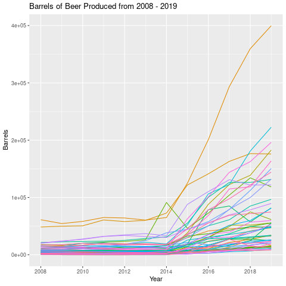

Bios 611 Project 1
==================
Alcoholic Beverage Consumption and Liver Disease
------------------------------------------------

Excessive alcohol consumption can cause a myriad of health problems, one of which is liver disease. An interesting observation from lung cancer is that as the prevalence of smoking decreased, the prevalence of lung cancer slowly ticked down as well. This project will investigate whether a similar trend can be observed from alcohol consumption and alcoholic liver disease. This project will use state level data of liver disease deaths from the CDC and state level data of taxable barrels from the Alcohol and Tobacco Tax and Trade Bureau.

The current version of the project will use taxable barrels as a proxy for overall consumption -- since likely brewers would not produce beer that is not meant to be consumed. Additionally, the first analysis will look at beer consumption, but wine and distilled spirits will be added.

Preliminary analysis shows that the amount of beer produced for consumption remained relatively constant but in recent years has seen a dramatic increase (the Alcohol and Tobacco Tax and Trade Bureau says this is because of an increase in small breweries).

How To Use This Project
-----------------------

To run this project, you will need Docker:

    > docker build . -t project1-env
    > docker run -v `pwd`:/home/rstudio -p 8787:8787\
     -e PASSWORD=<yourpassword> -t project1-env
