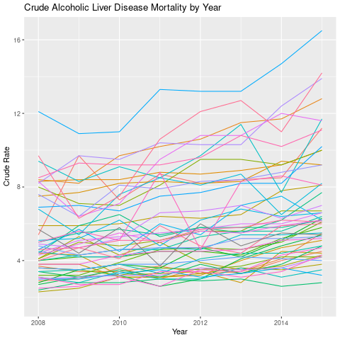

Bios 611 Project 1
==================
- [Introduction](#introduction)  
- [Usage](#how-to-use-this-project)  
  * [Report](#report)
  * [Shiny Dashboard](#shiny-dashboard)
  * [Python Addition](#python-project-addition)

Introduction
============
Alcoholic Beverage Consumption and Liver Disease
------------------------------------------------

Excessive alcohol consumption can cause a myriad of health problems, one of which is liver disease. An interesting observation from lung cancer is that as the prevalence of smoking decreased, the prevalence of lung cancer slowly ticked down as well. This project will investigate whether a similar trend can be observed from alcohol consumption and alcoholic liver disease. This project will use state level data of liver disease deaths from the CDC and state level data of taxable barrels from the Alcohol and Tobacco Tax and Trade Bureau.

The current version of the project will use taxable barrels as a proxy for overall consumption -- since likely brewers would not produce beer that is not meant to be consumed. Additionally, the first analysis will look at beer consumption, but wine and distilled spirits will be added.

Preliminary analysis shows that the amount of beer produced for consumption remained relatively constant but in recent years has seen a dramatic increase (the Alcohol and Tobacco Tax and Trade Bureau says this is because of an increase in small breweries).

Data from the CDC shows that there has been a steady increase in the crude rate of alcoholic liver disease over the past few years, which may be related to the recent increase in alcohol consumption.

How To Use This Project
=======================

To run this project, you will need Docker:

    > docker build . -t project1-env
    > docker run -v `pwd`:/home/rstudio -p 8787:8787 -p 8788:8788\
     -e PASSWORD=<yourpassword> -t project1-env

Then connect to port 8787 (the username is rstudio and the password is your chosen password).

Report
------
The Makefile is a good place to understand the dependencies of the project. To make the entire report, run the following line within the Rstudio terminal:

    > make report.pdf
    
Shiny Dashboard
---------------
To start the shiny dashboard, make sure you are connected to port 8787. Then within the rstudio terminal, run:

    > make beer_mortality_shiny

Then connect to port 8788.
    
Python Project Addition
-----------------------
To explore the python analysis in a jupyter notebook run the following:

    > docker run -p 8765:8765 -v `pwd`:/home/rstudio -e PASSWORD=<yourpassword> -it project1-env sudo -H -u rstudio /bin/bash -c\
     "cd ~/;\jupyter lab --ip 0.0.0.0 --port 8765"

You will receive a token like this: http://127.0.0.1:8765/?token=XXX
Use this to connect to port 8765 (make sure to change the IP to your own!).

If you would like to review the final report, open a terminal in jupyter and  run:

    > make python-report.pdf

